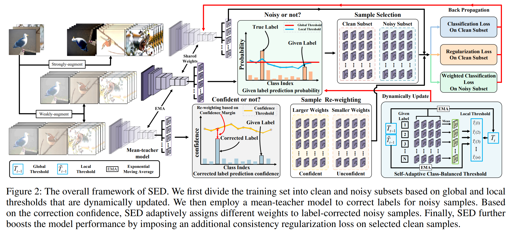
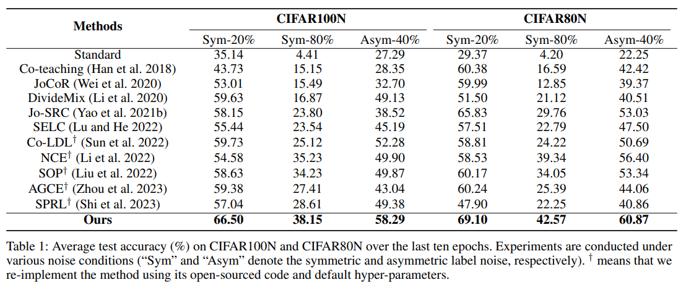

# SED:Foster Adaptivity and Balance in Learning with Noisy Labels
**Abstract:** Label noise is ubiquitous in real-world scenarios, posing a practical challenge to supervised models due to its effect in hurting the generalization performance of deep neural networks.
Existing methods primarily employ the sample selection paradigm and usually rely on dataset-dependent prior knowledge (e.g., a pre-defined threshold) to cope with label noise, inevitably degrading the adaptivity. Moreover, existing methods tend to neglect the class balance in selecting samples, leading to biased model performance.
To this end, we propose a simple yet effective approach named \textbf{SED} to deal with label noise in a \textbf{S}elf-adaptiv\textbf{E} and class-balance\textbf{D} manner. 
Specifically, we first design a novel sample selection strategy to empower self-adaptivity and class balance when identifying clean and noisy data.
A mean-teacher model is then employed to correct labels of noisy samples.
Subsequently, we propose a self-adaptive and class-balanced sample re-weighting mechanism to assign different weights to detected noisy samples.
Finally, we additionally employ consistency regularization on selected clean samples to improve model generalization performance.
Extensive experimental results on synthetic and real-world datasets demonstrate the effectiveness and superiority of our proposed method..

# Pipeline



# Installation
```
pip install -r requirements.txt
```

# Datasets
We conduct noise robustness experiments on two synthetically corrupted datasets (i.e., CIFAR100N and CIFAR80N) and three real-world datasets (i.e., Web-Aircraft, Web-Car and Web-Bird.
Specifically, we create the closed-set noisy dataset CIFAR100N and the open-set noisy dataset CIFAR80N based on CIFAR100.
To make the open-set noisy dataset CIFAR80N, we regard the last 20 categories in CIFAR100 as out-of-distribution. 
We adopt two classic noise structures: symmetric and asymmetric, with a noise ratio $n \in (0,1)$.

You can download the CIFAR10 and CIFAR100 on [this](https://www.cs.toronto.edu/~kriz/cifar.html).

You can download the Clothing1M from [here](https://github.com/NUST-Machine-Intelligence-Laboratory/weblyFG-dataset).

# Training

An example shell script to run SACB on CIFAR-100N :

```python
CUDA_VISIBLE_DEVICES=0 python main.py --warmup-epoch 20 --epoch 100 --batch-size 128 --lr 0.01 --warmup-lr 0.05  --noise-type symmetric --closeset-ratio 0.2 --lr-decay cosine:20,5e-4,100  --opt sgd --dataset cifar100nc  --momentum_scs 0.9 --momentum_scr 0.9 --alpha 1.0 --aph 0.99 
```
An example shell script to run SACB on CIFAR-80N :

```python
CUDA_VISIBLE_DEVICES=0 python main.py --warmup-epoch 20 --epoch 150 --batch-size 128 --lr 0.05 --warmup-lr 0.05  --noise-type symmetric --closeset-ratio 0.2 --lr-decay cosine:20,5e-4,140  --opt sgd --dataset cifar80no  --momentum_scs 0.999 --momentum_scr 0.85 --alpha 0.5 --aph 0.99  
```
Here is an example shell script to run SACB on Web-aircraft :

```python
CUDA_VISIBLE_DEVICES=0 python main_webfg.py --warmup-epoch 10 --epoch 110 --batch-size 32 --lr 0.005 --warmup-lr 0.005  --lr-decay cosine:10,5e-4,110 --weight-decay 5e-4 --seed 123 --opt sgd --dataset web-bird --SSL True --gpu 0 --momentum-mask 0.999 --momentum-qaq 0.99 --pretrain True --alpha 1 --aph 0.95 --save-weights True
```

# Results on Cifar100N and Cifar80N:




# Results on Web-aircraft, Web-bird, and Web-car:


# Effects of different compoments in test accuracy (%) onCIFAR100N (noise rate and noise type are 0.5 and symmetric,respectively)


